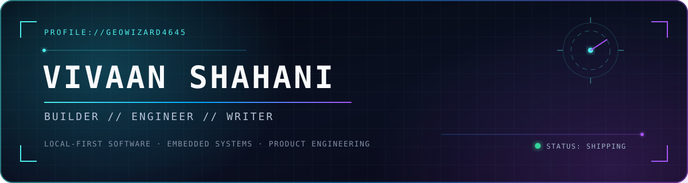

<div align="center">
  
</div>

<div align="center">
  <a href="https://vivaanshahani.com"></a>
  <a href="https://www.linkedin.com/in/vivaan-shahani-a682303b7/"></a>
  <a href="mailto:me@vivaanshahani.com"></a>
</div>

```text
vivaan@mac ~ % whoami
self-taught engineer building products where systems, design, and real users meet.

vivaan@mac ~ % status
shipping Caduceus · operating FitFo · growing Debate101 · open to Summer '27
```

## `01 // CURRENT SIGNAL`

I'm a student engineer, product builder, and writer based in Scarsdale, New York. I like taking ideas all the way from the first sketch to something people can actually install, use, and trust.

- 🪽 Creator of **[Caduceus](https://github.com/GeoWizard4645/caduceus)** — an open-source, local-first macOS command center built with Tauri and Rust
- ⚡ COO + engineer at **[FitFo](https://fitfo.app)** — working across product, infrastructure, operations, and growth
- 🎙️ Co-founder of **[Debate101](https://debate101.org)** — curriculum, design, platform, and community
- 🧭 Competitive debater, long-form writer, saxophonist, and DJ

## `02 // FEATURED BUILDS`

<table>
  <tr>
    <td width="50%" valign="top">
      <h3>🪽 <a href="https://github.com/GeoWizard4645/caduceus">Caduceus</a></h3>
      <p>A fast, local-first command center for macOS: app launcher, command palette, clipboard history, window tools, and optional AI agents.</p>
      <p><code>Rust</code> <code>Tauri</code> <code>TypeScript</code> <code>SQLite</code></p>
      <a href="https://caduceus.vivaanshahani.com">Website ↗</a>
    </td>
    <td width="50%" valign="top">
      <h3>📟 <a href="https://github.com/GeoWizard4645/sprig-dashboard">Sprig Dashboard</a></h3>
      <p>A multi-app dashboard for Hack Club's Sprig with weather, finance, live sports, Wi-Fi analysis, and system monitoring.</p>
      <p><code>MicroPython</code> <code>Embedded</code> <code>Async UI</code> <code>APIs</code></p>
      <a href="https://github.com/GeoWizard4645/sprig-dashboard">Source ↗</a>
    </td>
  </tr>
  <tr>
    <td width="50%" valign="top">
      <h3>🎙️ <a href="https://debate101.org">Debate101</a></h3>
      <p>A debate learning platform I co-founded and built—from information architecture and brand to foundational curriculum.</p>
      <p><code>Product</code> <code>Web</code> <code>Design</code> <code>Curriculum</code></p>
      <a href="https://debate101.org">Visit ↗</a>
    </td>
    <td width="50%" valign="top">
      <h3>🖊️ <a href="https://github.com/GeoWizard4645/BlotInator">BlotInator</a></h3>
      <p>An image-to-code pipeline for Hack Club's Blot drawing robot—turning raster images into generative pen-plotter art.</p>
      <p><code>JavaScript</code> <code>Generative Art</code> <code>Open Source</code></p>
      <a href="https://github.com/GeoWizard4645/BlotInator">Source ↗</a>
    </td>
  </tr>
</table>

## `03 // TOOLCHAIN`

<div align="center">
  
  
  
  
  
  
  
  
</div>

## `04 // OPERATING PRINCIPLES`

```text
01  Ship the complete loop, not just the demo.
02  Keep the interface sharp and the system understandable.
03  Make privacy and local-first behavior architectural choices.
04  Learn whatever the next useful thing requires.
```

## `05 // OFF THE TERMINAL`

When I'm not coding, I'm competing in debate, writing long-form essays read by 15K+ people, playing saxophone, DJing, or finding another field to get unreasonably curious about.

<div align="center">
  <br />
  <a href="https://vivaanshahani.com"><strong>Explore the full portfolio →</strong></a>
  <br /><br />
  <sub>Built with intent. Still shipping.</sub>
</div>
